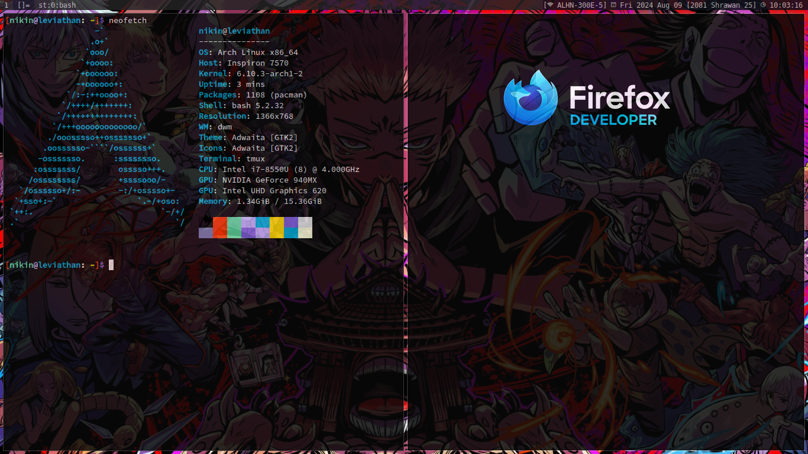
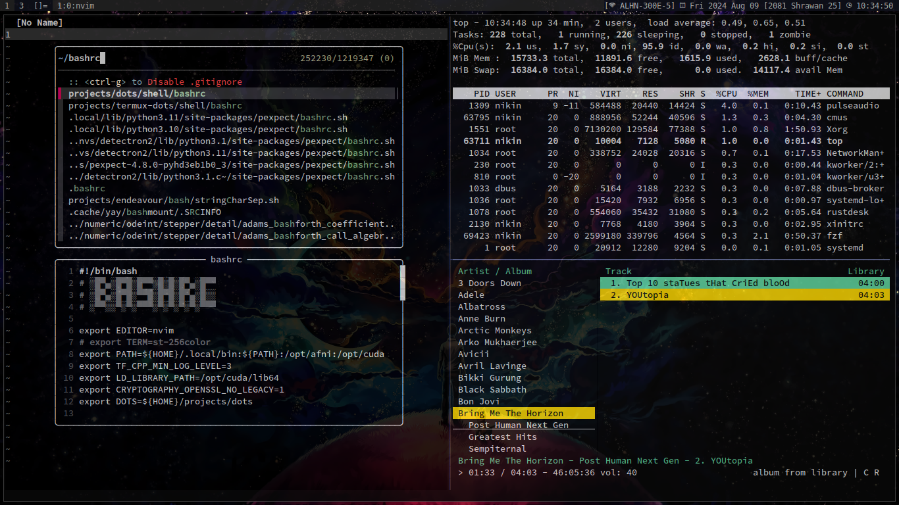
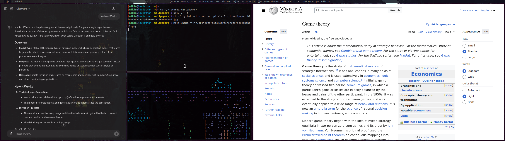

# README

See [my blog](link).

## Screenshots






Here's a screenshot of my dual monitor setup.




## Symlinks I Create Once And Forget

These handle `caps:esc` swap on tty.

1. `local/share/kbd/keymaps/us.map-custom.gz` inside `/usr/local/share/kbd/keymaps`.
1. `misc/HARDWARE/vconsole.conf` inside `/etc`.


## vim.pack 

Since pack is intentionally minimal, it has no concept of post installation
hooks. So run this is install `jsregexp`.

```sh
cd /home/nikin/.local/share/nvim/site/pack/core/opt/LuaSnip
make install_jsregexp
```

