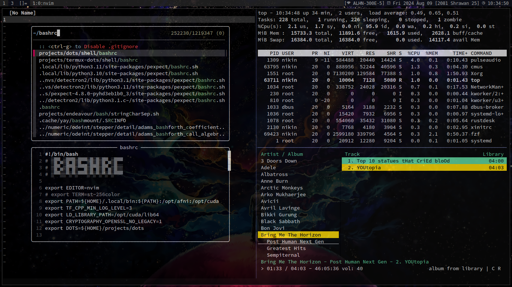
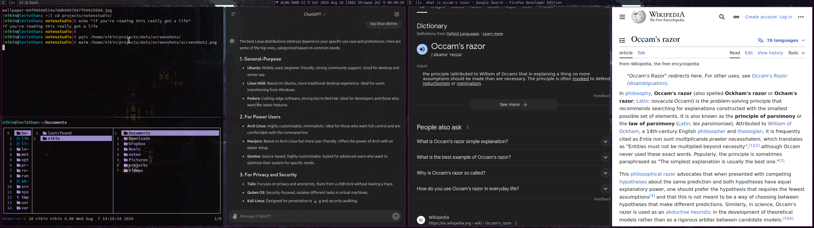

# README

See [my blog](link).

## Screenshots

Here's a screenshot of my dual monitor setup.

## Symlinks I Create Once And Forget

These handle `caps:esc` swap on tty.

1. `local/share/kbd/keymaps/us.map-custom.gz` inside `/usr/local/share/kbd/keymaps`.
1. `misc/HARDWARE/vconsole.conf` inside `/etc`.

